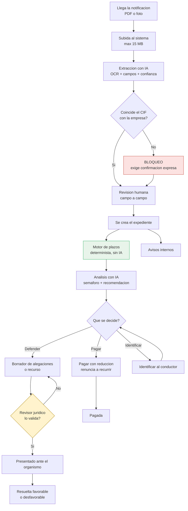
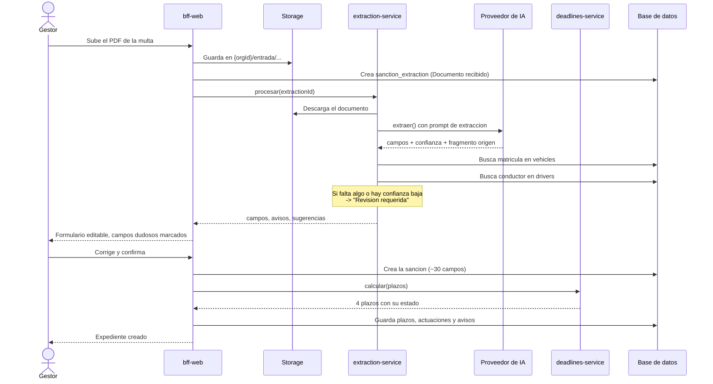
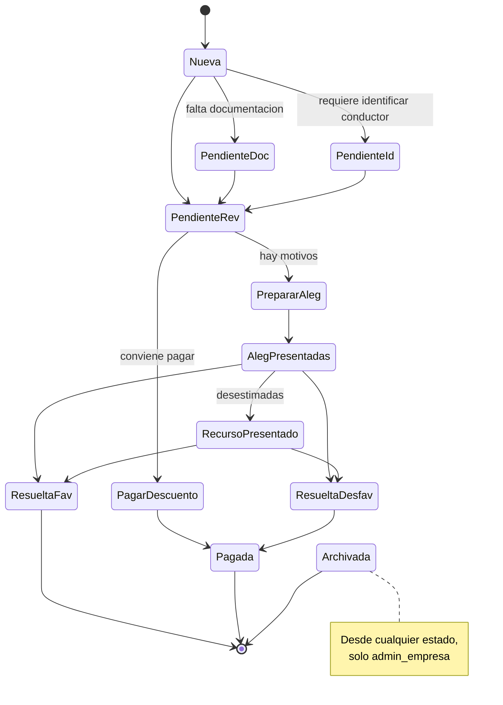
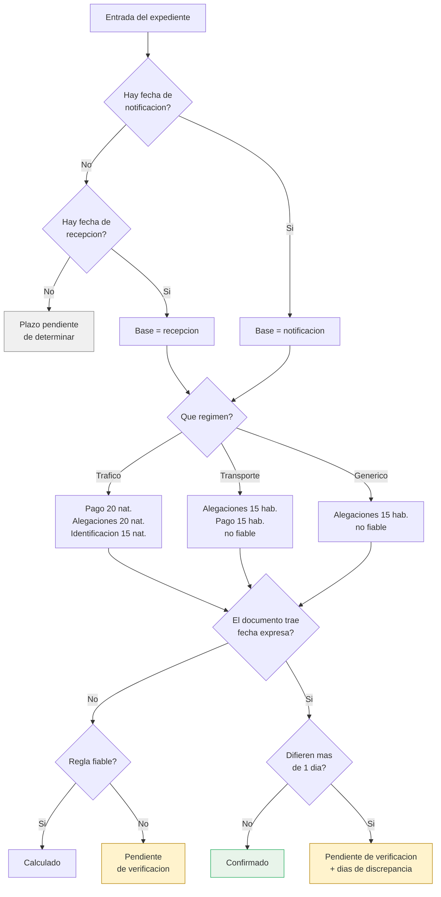
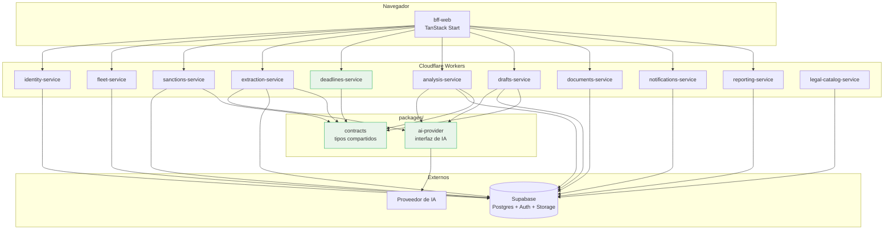

# Flujos del sistema

Cómo circula una multa por Sanciona Fleet, de principio a fin. Los diagramas
usan Mermaid y se renderizan directamente en GitHub.

---

## 1. Recorrido completo de un expediente

Dos puntos de control humano, en verde y ámbar, que son el corazón del producto:

- **El motor de plazos no usa IA.** Es determinista y auditable, porque un error
  aquí hace perder un plazo legal.
- **Ningún escrito sale sin que un revisor jurídico lo valide.** La IA redacta;
  una persona responde.

---

## 2. Alta desde documento, paso a paso

Lo que hace este flujo distinto de "subir un PDF y fiarse": **cada campo llega
con su nivel de confianza y el fragmento literal del documento del que salió**,
y los siete campos críticos se marcan para verificar si la confianza es baja.
La IA propone; el gestor confirma.

---

## 3. Máquina de estados del expediente

🟡 Propuesta de SPEC.md §4.2, **pendiente de confirmación**. Hoy el sistema
permite ir de cualquier estado a cualquier otro sin restricción.

Cada transición debe registrarse en `sanction_actions` **con estado origen y
destino**. Hoy solo se guarda el literal "Cambio de estado", sin ese detalle.

---

## 4. Cómo decide el motor de plazos

Tres decisiones de diseño que conviene entender:

1. **Nunca se calcula desde la fecha de emisión.** Si falta la notificación, el
   plazo queda "pendiente de determinar" antes que dar una fecha falsa.
2. **El documento manda sobre el cálculo**, pero se contrasta: si discrepan más
   de un día, se avisa con los días exactos de diferencia.
3. **Las reglas poco fiables se marcan como tales**, no se presentan con la
   misma autoridad que las seguras.

---

## 5. Arquitectura objetivo

En verde, lo que **ya está construido y con tests**: `deadlines-service`,
`packages/ai-provider` y `packages/contracts`. El resto sigue dentro del
monolito heredado, y se irá extrayendo en el orden de SPEC.md §7.5.
