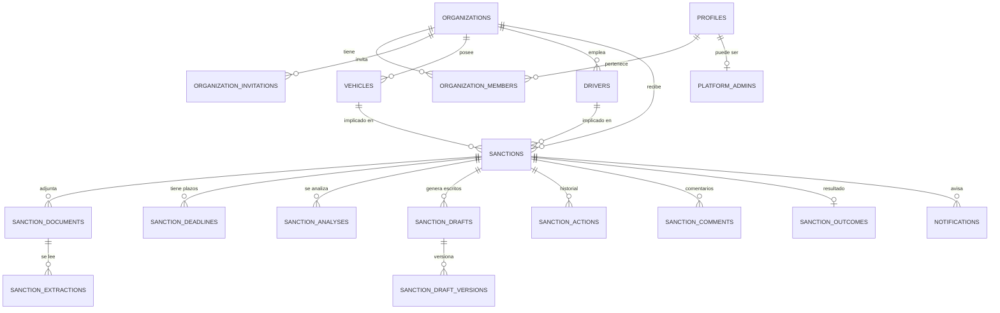

# Modelo de datos

23 tablas en PostgreSQL (Supabase), todas con Row Level Security activo.
El detalle del esquema vive en `multas-export/supabase/migrations/`.
Aquí está lo que hay que entender para trabajar con él.

---

## 1. Mapa de entidades

`legal_sources`, `activity_logs`, `document_access_logs` e
`integration_endpoints` quedan fuera del diagrama por claridad: las dos primeras
son transversales, la tercera auditoría y la cuarta está vacía.

---

## 2. Las entidades, agrupadas

### Identidad y organización

| Tabla | Para qué | Nota |
|---|---|---|
| `organizations` | La empresa de transporte. **El tenant.** | Añadido `plan` (12 sep) |
| `organization_members` | Quién pertenece a qué empresa y con qué rol | Relación N:M; permite que un usuario esté en varias empresas |
| `organization_invitations` | Invitaciones pendientes por correo | El trigger `handle_new_user` las resuelve al registrarse |
| `profiles` | Espejo de `auth.users` | Añadido `username` con índice único (12 sep) |
| `platform_admins` | Superadministradores de plataforma | Sin pantalla de gestión: hoy se puebla por migración |

### Flota

`vehicles` (matrícula, código interno, marca, modelo, tipo, estado) y `drivers`
(nombre, documento, contacto, estado). Ambas cuelgan de la organización.

### El expediente y sus satélites

| Tabla | Para qué |
|---|---|
| `sanctions` | **La entidad central.** ~50 columnas |
| `sanction_documents` | PDFs e imágenes asociados |
| `sanction_extractions` | Lo que la IA leyó: campos, confianza, avisos, texto OCR |
| `sanction_deadlines` | Los 4 plazos calculados, con su estado |
| `sanction_analyses` | Semáforo, recomendación, factores, revisiones |
| `sanction_drafts` + `sanction_draft_versions` | Escritos y sus versiones |
| `sanction_actions` | Historial. **Append-only** |
| `sanction_comments` | Notas internas |
| `sanction_outcomes` | Resultado para analítica. **Vacía: nadie la escribe** |

### Transversales

`legal_sources` (catálogo jurídico global, sin `organization_id`, solo lectura),
`notifications` (avisos internos), `activity_logs` y `document_access_logs`
(auditoría; la segunda **nunca se escribe**), `integration_endpoints` (vacía).

---

## 3. `sanctions` — los campos que importan

La tabla creció en dos oleadas y eso se nota:

**Bloque original** — lo que cualquier gestor rellenaría: `reference_number`,
`sanctioning_authority`, `sanction_category`, `violation_date`,
`notification_date`, `payment_deadline`, `appeal_deadline`, `original_amount`,
`discounted_amount`, `points`, `vehicle_id`, `driver_id`, `status`, `priority`.

**Bloque de extracción documental** — lo que solo aparece si lo lee la IA:
`infraction_time`, `location`, `road`, `kilometer_point`, `municipality`,
`province`, `legal_norm`, `legal_article`, `legal_section`, `qualification`,
`reported_facts`, `surcharge_amount`, `discount_percentage`,
`requires_driver_identification`, `driver_identification_deadline`,
`denouncing_agent`, `evidence_mentioned`, `complaint_date`, `issue_date`,
`reception_date`, `traffic_light`, `analysis_status`.

⚠️ **El alta manual deja vacío todo el segundo bloque.** De ahí que informes que
dependen de esos campos (como el agrupado por municipio) queden en blanco para
expedientes creados a mano.

### Las tres fechas que se confunden

| Campo | Qué es | ¿Sirve para plazos? |
|---|---|---|
| `issue_date` | Cuándo se redactó el documento | ❌ **Nunca** |
| `notification_date` | Cuándo se notificó formalmente | ✅ **Es la buena** |
| `reception_date` | Cuándo llegó a la empresa | ✅ Sustituto si falta la anterior |

---

## 4. Invariantes

Reglas que no se rompen nunca. Si una se viola, hay un bug.

| # | Invariante | Dónde se garantiza |
|---|---|---|
| I-1 | Toda fila de negocio pertenece a exactamente una organización | `organization_id NOT NULL` + `ON DELETE CASCADE` |
| I-2 | Nadie ve datos de una organización a la que no pertenece | RLS + `is_org_member()` |
| I-3 | El historial de actuaciones no se modifica ni se borra | `UPDATE/DELETE USING (false)` |
| I-4 | Una versión de escrito, una vez creada, es inmutable | Igual que I-3 + `UNIQUE (draft_id, version)` |
| I-5 | Un expediente tiene como mucho un plazo de cada tipo | `UNIQUE (sanction_id, deadline_type)` |
| I-6 | Un expediente tiene como mucho un resultado | `UNIQUE (sanction_id)` en `sanction_outcomes` |
| I-7 | Solo un revisor jurídico marca un borrador como "Validado" | ⚠️ Solo en aplicación (UI + mutación), **no en base de datos** |
| I-8 | Un plazo sin fecha de notificación ni de recepción queda "pendiente de determinar" | `deadlines-service`, con test |
| I-9 | Dos usuarios no comparten `username` | Índice único sobre `lower(username)` |

**I-7 es la más frágil**: la barrera humana que sostiene todo el producto vive
en el código de aplicación, no en la base de datos. Un acceso directo a la tabla
la salta. Merece una política RLS propia.

---

## 5. Seguridad a nivel de fila

El aislamiento entre empresas no es una condición `WHERE` en el código: lo
impone PostgreSQL. Funciones `SECURITY DEFINER`, todas revocadas para `PUBLIC`
y `anon`:

| Función | Responde a |
|---|---|
| `is_org_member(org)` | ¿Pertenece el usuario actual a esta organización? |
| `has_org_role(org, rol)` | ¿Con este rol concreto? |
| `can_manage_records(org)` | ¿Es admin o gestor? (no revisor jurídico) |
| `shares_org_with(user)` | ¿Comparten alguna organización? |
| `sanction_belongs_to_org(s, org)` | ¿Este expediente es de esta organización? |
| `is_platform_admin()` | ¿Superadministrador de plataforma? |
| `ensure_active_organization()` | Devuelve su organización; si no tiene, se la crea |

**Consecuencia práctica:** una consulta que olvide filtrar por
`organization_id` sigue siendo segura, porque RLS la filtra. Pero es una sola
capa: SPEC.md RS-2 pide filtrar también en la aplicación.

---

## 6. Deuda conocida del modelo

| Problema | Detalle |
|---|---|
| **Tres tablas muertas** | `sanction_outcomes`, `document_access_logs` e `integration_endpoints` están diseñadas y nunca se escriben |
| **`sanction_deadlines` infrautilizada** | Se calcula y se guarda, pero calendario, dashboard y listados leen los campos planos de `sanctions` e ignoran los estados del plazo (RF-PLAZO-4) |
| **Prioridad inconsistente** | `Media` existe en el enum y se usa como valor inicial, pero no es seleccionable; `Normal` es redundante |
| **Dos catálogos de categorías** | 14 y 10 valores escribiendo en el mismo campo |
| **`legal_sources` sin mantenimiento** | Global y solo escribible por `service_role`: no hay pantalla para actualizarla cuando cambie una norma |
| **Sin caducidad ni prescripción** | El art. 112 está cargado como fuente, pero el sistema no vigila esos plazos |
